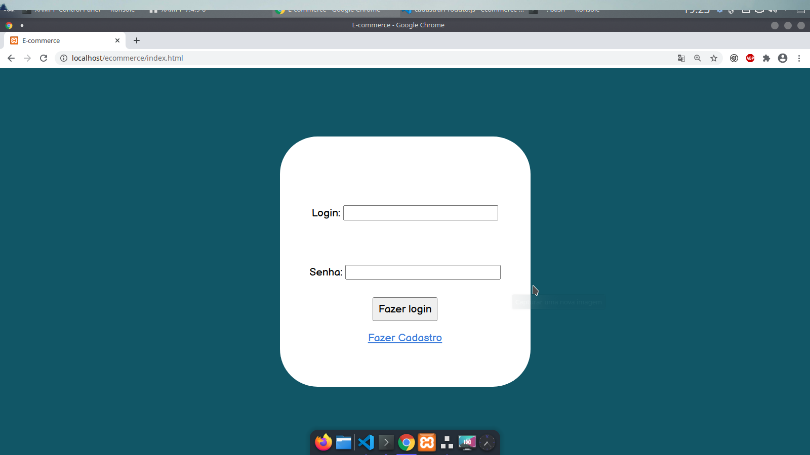
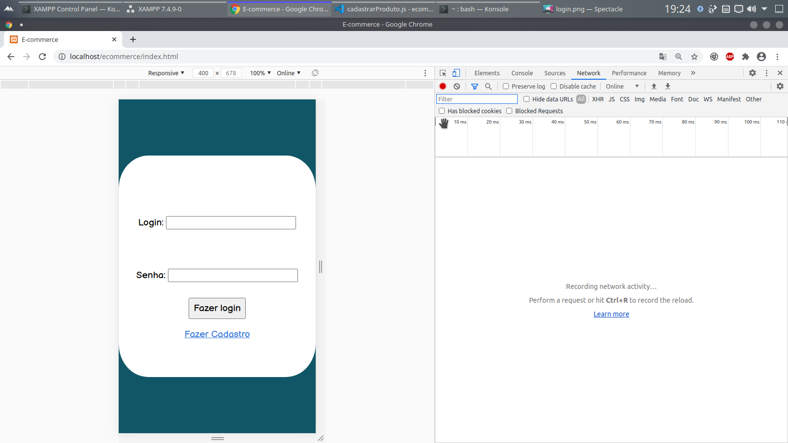
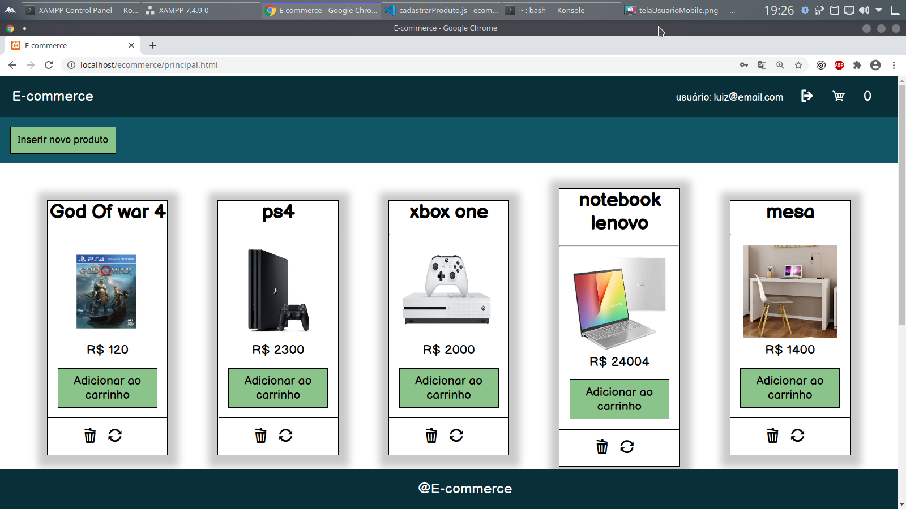
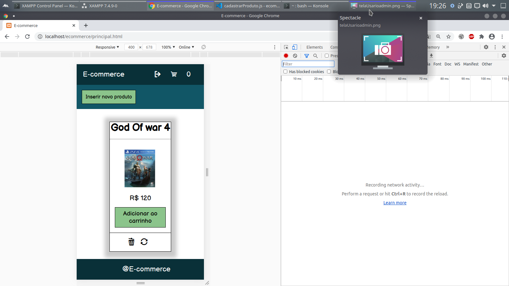
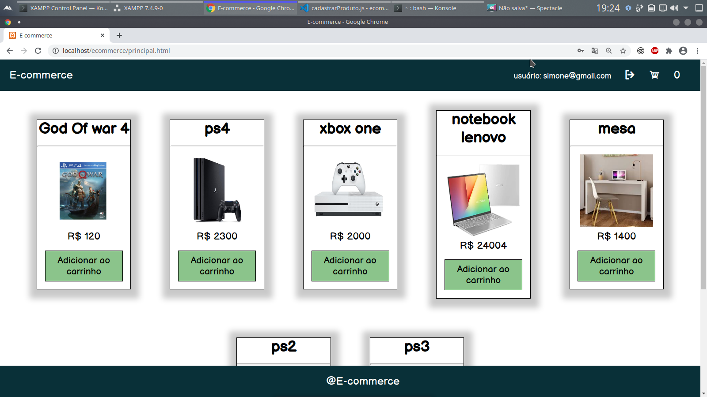
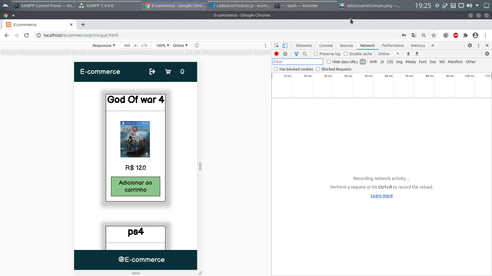

<h1 align="center">Loja online simples</h1>

 Uma simples loja online com funcionalidade para usuários comuns e funcionalidades de usuários administradores.

    <ul>
        <li><a href="https://www.php.net/">🔗 Php</a></li>
        <li><a href="https://www.mysql.com/">🔗 Mysql</a></li>
        <li><a href="https://jquery.com/">🔗 Jquery</a></li>
        <li><a href="https://developer.mozilla.org/pt-BR/docs/Web/HTML">🔗 Html</a></li>
        <li><a href="https://developer.mozilla.org/pt-BR/docs/Web/CSS">🔗 Css</a></li>
    </ul>

    Clonar projeto: git clone https://github.com/PedroHenrique-git/SimpleOnlineStore.git

Tela de login: 

Tela de login mobile:

Tela usuario admin:

Tela usuario admin mobile:

Tela usuario comum:

Tela usuario comum mobile:

